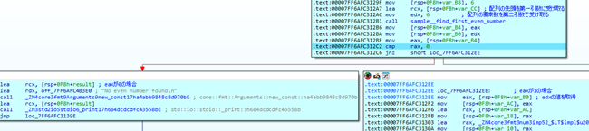
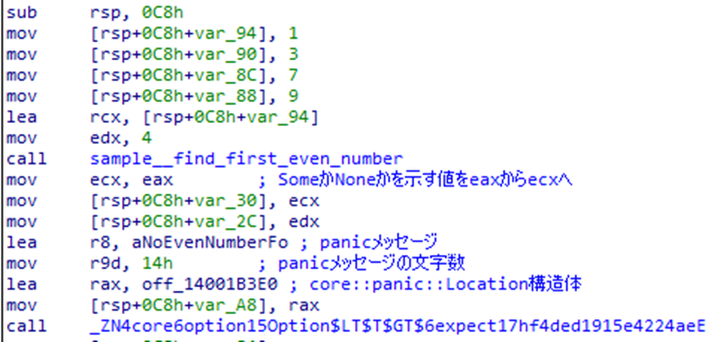
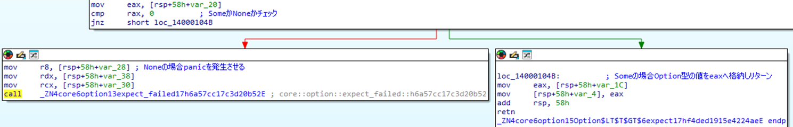
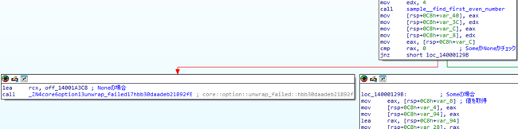

# 列挙型

Rustにおける列挙型は、いくつかの異なる要素の型の中から一つを選択する場面で利用される。特に、Rustの列挙型は各要素に異なる型を柔軟に指定できる点が特徴的である。

本調査では、Rustの列挙型の中でも特に広く利用されている`Option`型について調査を行った。`Option`型は、値が存在する場合にはその値を返す`Some`、存在しない場合には`None`を返す列挙型である。この`Option`型がアセンブリレベルでどのように実装されているかを調査した。また、`Option`型に関連して使用可能な、`expect()`や`unwrap()`などのパニックを引き起こす関数のアセンブリについても調査した。

## 調査結果

* `Option`型では、`Some`または`None`を示す判別値がeaxレジスタで返される。eaxが1の場合は`Some`、0の場合は`None`を示す。
  - `Some`の場合、その値はedxレジスタで返される。

なお、32ビットバイナリにおいても、引数の受け渡し方法やアドレスサイズを除いて実装は同様であることが確認できた。

## 詳細

調査に使用したサンプルプログラムは、[後半](#使用したサンプルプログラム)に記載している。

### Option型

リリースビルド、最小化バイナリでサンプルプログラムをビルドした場合、最適化によって無駄な処理が削除されるため、最適化の影響を受けないデバッグビルドのバイナリで調査した。

RustのOption型において、`Some`か`None`かはeaxレジスタで返され、1がSome、0がNoneを示す。
Option型の関連する処理である戻り値をサンプルプログラムで確認すると、eaxレジスタへ1が、edxレジスタへ2が格納されている。
edxレジスタに格納された2はサンプルプログラムで定義した配列の最初の偶数である。
eaxレジスタの値が0か否かをチェックし、1の場合(Some)は、edxレジスタの値を出力し、0の場合(None)は文字列`No even number found`を出力する。



### expect()

リリースビルド、最小化バイナリでサンプルプログラムをビルドした場合、最適化によって無駄な処理や`expect()`が削除されるため、最適化の影響を受けないデバッグビルドのバイナリで調査した。

`expect()`は、第一引数に`Some`か`None`かを示す値、第二引数にOption型の値、第三引数に`panic`メッセージ、第四引数にパニックメッセージの文字数、第五引数に`core::panic::Location`構造体を受け取る。



以下は、expect()の内部処理であるが、内部では`Some`か`None`かのチェックを行い、`Some`の場合は第二引数の値をそのまま返却し、`None`の場合はパニックを発生させる。



### unwrap()

リリースビルド、最小化バイナリでサンプルプログラムをビルドした場合、最適化によって無駄な処理や`unwrap()`が削除されるため、最適化の影響を受けないデバッグビルドのバイナリで調査した。

以下は、サンプルプログラムの結果であるが、`unwrap()`がインライン展開されていおり、処理からは`unwrap()`の使用が確認出来なくなった。



## 使用したサンプルプログラム

* Option型

```rust
fn find_first_even_number(numbers: &[i32]) -> Option<i32> {
    for &number in numbers {
        if number % 2 == 0 {
            return Some(number);
        }
    }
    None
}

fn main(){
    let numbers = [1, 2, 3, 4, 5, 6];
    let result = find_first_even_number(&numbers);
    match result {
        Some(even_number) => println!("Even number: {}", even_number),
        None => println!("No even number found"),
    }
}
```

* expect()

```rust
fn find_first_even_number(numbers: &[i32]) -> Option<i32> {
    for &number in numbers {
        if number % 2 == 0 {
            return Some(number);
        }
    }
    None
}

fn main() {
    let numbers = [1, 3, 7, 9];
    let result = find_first_even_number(&numbers);

    let even_number = result.expect("No even number found");
    
    println!("Even number: {}", even_number);
}
```

* unwrap()

```rust
fn find_first_even_number(numbers: &[i32]) -> Option<i32> {
    for &number in numbers {
        if number % 2 == 0 {
            return Some(number);
        }
    }
    None
}

fn main() {
    let numbers = [1, 3, 7, 9];
    let result = find_first_even_number(&numbers);

    let even_number = result.unwrap();

    println!("Even number: {}", even_number);
}
```
