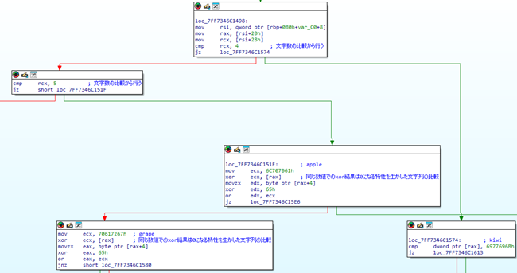

# match文

Rustにおけるmatch文がアセンブリレベルでどのような特徴を持つか調査した。

## 調査結果

* 列挙型
  - 最適化の過程で処理が省略される場合もあるが、基本的にはcmp命令やjmp命令による分岐、またはジャンプテーブルによる分岐に変換される。match文特有のアセンブリ命令は確認できなかった。

* 文字列
  - 文字列の場合、特有の分岐方法が適用されることがあることが判明した。

## 詳細

### 列挙型

省略

### 文字列

文字列を用いたmatch文ではリリースビルドおよび最小化バイナリにて同様の特徴がある。
以下で比較部分のアセンブリを示しているとおり、文字数の比較を行った後に、文字列の比較を行っている。
最適化によって、より早く処理できる文字数の比較を行うことで無駄な文字列の比較を省いていると考えられる。
文字列の比較では、一般的に行われる文字列の比較はcmp命令や`memcmp()`、`strcmp()`などのAPIを用いたものであるが、本バイナリではxor命令を用いて文字列の比較を行っていた。
これは同じ数値同士のxor演算の結果は0になるという特性を利用した比較方法である。
なお、32ビットバイナリにおいても同様の特徴がある。



## 使用したサンプルプログラム

* 文字列

```rust
use std::env;

fn main() {
    let args: Vec<String> = env::args().collect();

    if args.len() < 2 {
        return;
    }

    let input = &args[1];

    match input.as_str() {
        "apple" => println!("this is an apple."),
        "banana" => println!("this is a banana."),
        "orange" => println!("this is a orange."),
        "grape" => println!("this is a grape."),
        "kiwi" => println!("this is a kiwi."),
        _ => println!("this is an unknown fruit."),
    }
}
```