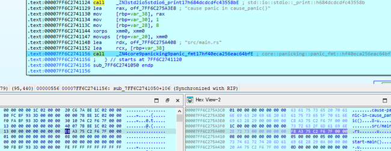
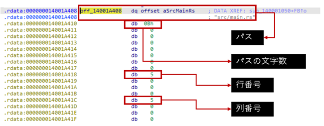
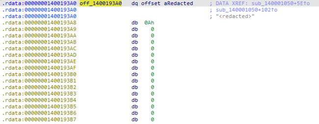
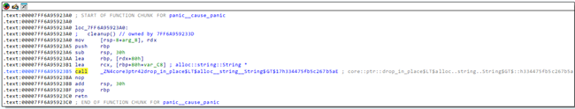

# Panic文

Rustにおけるパニック関連のアセンブリの特徴を解析するとともに、パニック時の挙動である`unwind`と`abort`のアセンブリ上の差分を明らかにすることを目的として調査した。

## 調査結果

* `panic!()`マクロは`core::panicking::panic_fmt()`関数の呼び出しに展開される。この際、パニックが発生したファイル名・行番号・列番号を含む`core::panic::Location`構造体が引数として渡される。

* パニック関連のアセンブリには、戻らない関数（リターンしない関数）の呼び出しや、Windows APIである`RtlFailFast()`や`_CxxThrowException()`の呼び出しが含まれることが確認された。

* パニック時の挙動について、`unwind`オプションを使用した場合、文字列などのリソースを解放する処理が存在する。一方、`abort`オプションを使用した場合はこのようなリソース解放処理が存在しない。

## 詳細

### パニック関連のアセンブリの特徴

`panic!()`マクロは、以下のように関数`core::panicking::panic_fmt()`を呼び出す処理へ展開される。
`core::panicking::panic_fmt()`は、パニックメッセージとともにパニックを発生させるエントリーポイントとなる関数である。

当該関数は、第一引数にフォーマットされたパニックメッセージ、第二引数に`core::panic::Location`構造体を受け取る。
`core::panic::Location`構造体にはパニックが発生したソースコードのパスや行番号、列番号が格納されており、パニック関連の処理の開始を識別可能な情報といえる。

ただし、最小化バイナリのビルドに用いられる`-Zlocation-detail=none`を用いることで、`core::panic::Location`構造体は以下のようになり、パニック関連の情報が削除される。

### unwindとabortにおけるアセンブリの差分

Rustは、パニック時の動作に`unwind`または`abort`を指定する。
`unwind`はデフォルトの動作であり、プログラムがパニックに陥った際にスタックを巻き戻し、リソースの解放などを行った後にプログラムを終了させる。
`abort`はスタックの巻き戻しを行わず、即座にプログラムを終了させる。
`unwind`動作時は、アセンブリにリソースの解放を行わせる以下のようなコード(`drop_in_place`関数など)が追加される。

### 32ビットおよび最小化バイナリにおける差異

32ビットバイナリにおいても[パニック関連のアセンブリの特徴](#パニック関連のアセンブリの特徴)で示した特徴が確認された。

最小化バイナリにおいては、ビルドオプションで指定した`-Zbuild-std-features=panic_immediate_abort`の効果によりパニック関連の処理は省略された。