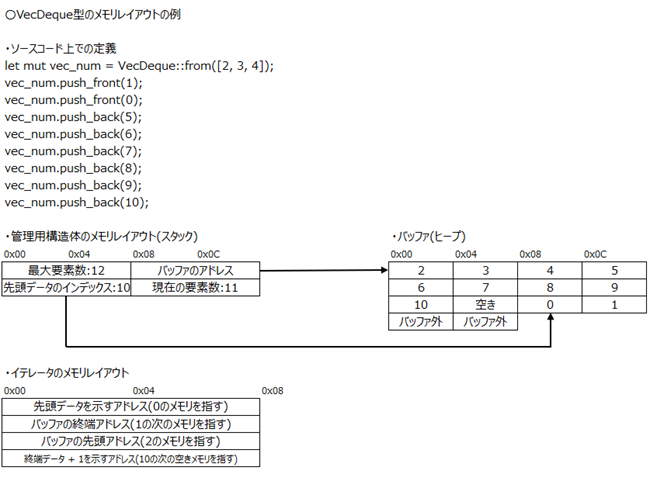

# イテレータ

Rustにおけるイテレータのメモリレイアウトを解析し、特に使用頻度の高い `Vec` 型と `VecDeque` 型のイテレータ構造や特徴を明らかにすることを目的として調査した。

## 調査結果

* **Vec型のイテレータ**

  * バッファーの先頭アドレスと終端アドレスの2つで構成される。
  * リリースビルドや最小化バイナリでは、最適化によりイテレータの使用痕跡が確認できない。

* **VecDeque型のイテレータ**

  * 循環バッファーとして設計されているため、以下4つのポインターで構成される。

    1. 先頭データを示すアドレス
    2. バッファー終端アドレス
    3. バッファー先頭アドレス
    4. 終端データ + 1 を示すアドレス
  * この構造により循環データの特性を活かした効率的なイテレーションを実現している。

### Vec型のイテレータのメモリレイアウト

Vec型のイテレータのメモリレイアウトは以下の図のとおり。
なお、Vec型の管理用構造体については [コレクション](17_collection.md)を参照。


### VecDeque 型のイテレータのメモリレイアウト

VecDeque型のイテレータのメモリレイアウトは以下の図のとおり。
なお、VecDeque型の管理用構造体については [コレクション](17_collection.md)を参照。



## 詳細

調査に使用したサンプルプログラムは、[後半](#使用したサンプルプログラム)に記載している。

### Vec型のイテレータ

#### 最適化の影響を受けない場合(デバッグビルド)

以下は、サンプルプログラムにおけるiter()の呼び出し箇所を示している。


iter()は第一引数にVecの先頭アドレス、第二引数にVecの現在の要素数を受け取る。
これらの値はVec型の管理用構造体から取得している。
内部では、Vecの終端要素のオフセットを算出するために、現在の要素数×要素あたりのバイト数（4バイト）の計算を行う。
その後、先頭アドレスに終端要素のオフセットを加算し、終端アドレスを算出する。
最終的にraxレジスタに先頭アドレス、rdxレジスタに終端アドレスを格納し、リターンする。


後続の呼び出しである`filter()`、`cloned()`、`collect()`は第一引数に先頭アドレス、第二引数に終端アドレスを受け取り、Vecの各要素にアクセスする。

#### 最適化の影響を受けた場合(リリースビルド)

リリースビルドしたバイナリではイテレータが使用されておらず、`filter()`、`cloned()`、`collect()`といった高レベルな処理はアセンブリ上では確認できない。
これらの処理はコンパイラの最適化によってインライン展開され、不要な部分が削除されたとものと考えられる。

以下は、サンプルプログラムにおけるVecの各要素に対して偶数チェックを行い、奇数のみを抽出して新しいVecを作成する箇所である。


アドレス`0x00007FF6A4041360`では、Vecの終端チェックが行われている。
r12レジスタには現在指している要素へのオフセットが格納されており、`0x1C(28)`は4バイト×7要素のVecにおける終端のオフセットを示している。
アドレス`0x00007FF6A4041366`から始まるブロックでは、以下の処理が行われている。

* 現在の要素をVecから取得し、r12レジスタに格納されたオフセットを次の要素を指すように4加算する。
* test命令と即値1を用いて偶数判定を行う。この判定では、偶数は1ビット目が0、奇数は1ビット目が1である性質を利用している。
  - 判定の結果、偶数の場合は終端チェックに遷移し、奇数の場合は新しい奇数のみのVecへ要素を追加する処理に遷移する。

アドレス`0x00007FF6A4041374`では、Vecの容量チェックが行われている。
すでに容量の最大値に達している場合、アドレス`0x00007FF6A404137A`に遷移し新しい容量を確保する。
その後、アドレス`0x00007FF6A4041389`でVecに要素を追加し、管理用構造体における現在の要素数をインクリメントする。

このように、最適化が行われているバイナリでは、イテレータを用いず、C/C++言語のバイナリにおける配列へのアクセスに類似したアセンブリとなる。

### VecDeque型のイテレータ

リリースビルドしたバイナリでは、`filter()`、`map()`といった高レベルな処理は、アセンブリ上では確認できないが、iter()の呼び出しは最適化の影響でインライン展開されており、イテレータを取得する処理は確認できる。
以下は、サンプルプログラムにおける`iter()`のアセンブリを示している。


アドレス`0x00007FF67AD11820`から`0x00007FF67AD11864`においては、以下のデータが取得されている。

1.	先頭データを示すアドレス
2.	バッファーの終端を示すアドレス
3.	バッファーの先頭アドレス
4.	終端データ+1を示すアドレス

これらのデータは、VecDeque型へのアクセスやループ処理に使用されており、この構造がイテレータに該当する。
また、アドレス`0x00007FF67AD11880`で呼び出される関数は、第二引数としてイテレータを受け取り、`filter()`や`map()`に渡されたクロージャを実行する。

### 32ビットおよび最小化バイナリにおける差異

* Vec型およびVecDeque型では、アドレスサイズを除けば32ビットと64ビットのプログラムの間にイテレータの構造に差異はみられない。
* Vec型では、リリースビルドおよび最小化ビルドでは、イテレータは省略される。
* VecDeque型では、リリースビルドおよび最小化ビルドにおいてイテレータが使用されている。
  - イテレータの構造や取得処理に差異は確認できなかった。

## 使用したサンプルプログラム

* Vec型のサンプルプログラム

```rust
fn main() {
    // 1. Vecの作成
    let mut vec_num = vec![1, 2, 3, 4, 5];
    
    // 2. Vecの長さと容量
    println!("vec_numの長さ: {}, 容量: {}", vec_num.len(), vec_num.capacity());

    // 3. 要素の追加
    vec_num.push(6);
    println!("vec_numの長さ: {}, 容量: {}", vec_num.len(), vec_num.capacity());

    vec_num.insert(3, 99);

    // 4. イテレーション
    // vec_numを奇数のみのVecにする
    let odd_numbers: Vec<i32> = vec_num.iter()
        .filter(|&num| num % 2 != 0)
        .cloned()
        .collect();
    
    println!("odd_numbersの要素:");
    for value in &odd_numbers {
        println!("{}", value);
    }
}
```

* VecDeque型のサンプルプログラム

```rust
use std::collections::VecDeque;

fn main() {
    // 1. VecDequeの作成
    let mut vec_num = VecDeque::from([2, 3, 4]);
    let vec_iter_test = VecDeque::from([0, 1, 2]);

    let it = vec_num.iter();

    // 2. VecDequeの長さと容量
    println!("vec_numの長さ: {}, 容量: {}", vec_num.len(), vec_num.capacity());

    // 3. 要素の追加
    vec_num.push_front(1);
    vec_num.push_front(0);
    vec_num.push_back(5);
    vec_num.push_back(6);
    vec_num.push_back(7);
    vec_num.push_back(8);
    vec_num.push_back(9);
    vec_num.push_back(10);

    let it2 = vec_num.iter();

    let num = vec_num[3];
    println!("{}", num);

    // 4. 要素の削除
    vec_num.pop_front();

    // 5. イテレータトレイト
    let numbers: VecDeque<i32> = vec_num.iter()
        .filter(|&&num| num % 2 != 0)
        .map(|&num| num * 2)
        .collect();
    
    println!("numbersの要素:");
    for value in &numbers {
        println!("{}", value);
    }
    
    let numbers: VecDeque<i32> = vec_iter_test.iter()
        .filter(|&&num| num % 2 != 0)
        .map(|&num| num * 2)
        .collect();

    println!("numbersの要素:");
    for value in &numbers {
        println!("{}", value);
    }
}
```