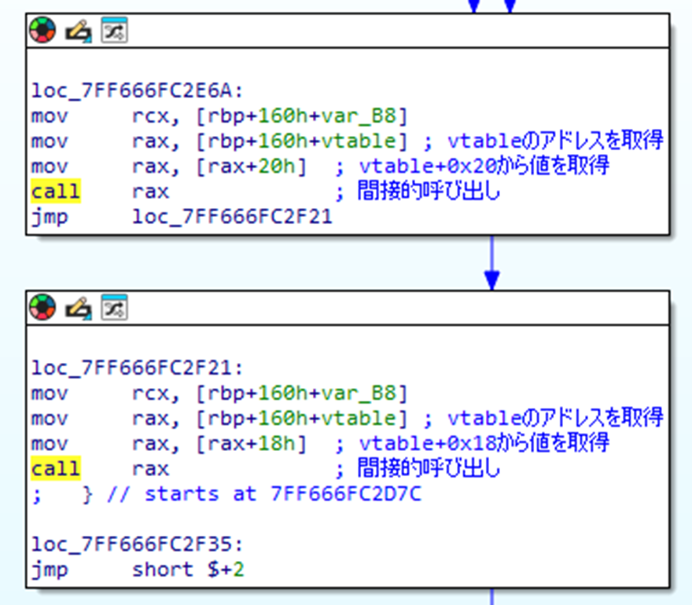

# 動的ディスパッチ参照

トレイトオブジェクトを用いた動的ディスパッチ参照について、アセンブリ上の特徴を調査した。

## 調査結果

デバッグビルドのバイナリにおいては、VTable構造体を用いた関数呼び出し行われる。
VTableの構造は下記のとおりである。

* 64ビットバイナリ

```c
vtable {
    0x00: デストラクター
    0x08: 実装元構造体のサイズ
    0x10: 実装元構造体のアラインメント
    ..以降メソッドへのポインター..
}
```

* 32ビットバイナリ

```c
vtable {
    0x00: デストラクター
    0x04: 実装元構造体のサイズ
    0x08: 実装元構造体のアラインメント
    ..以降メソッドへのポインター..
}
```

なお、リリースビルドおよび最小化バイナリにおいては、VTableが削除される（一般的な条件分岐に変換される）場合がある。

## 詳細

デバッグビルドのバイナリでは、動的ディスパッチ参照によって関数呼び出しがVTable構造体による間接呼び出しとなる。
以下は、IDA ProによってVTableと命名されたアドレスをスタックへ配置する処理である。


その後、VTableから値を取得する処理や、間接関数呼び出しが確認できる。それぞれ第一引数には構造体のアドレスを受け取る。

