# コレクション

Vec型、VecDeque型、HashMap型のメモリレイアウトやアセンブリ上の特徴を解析し、それぞれの構造や動作を明らかにすることを目的として調査した。

## 調査結果

### Vec型のメモリレイアウト

Vec型のメモリレイアウトを以下に記載する。

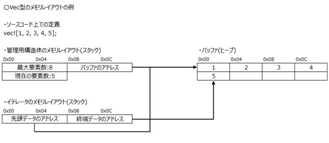

### VecDeque型のメモリレイアウト

VecDeque型のメモリレイアウトを以下に記載する。

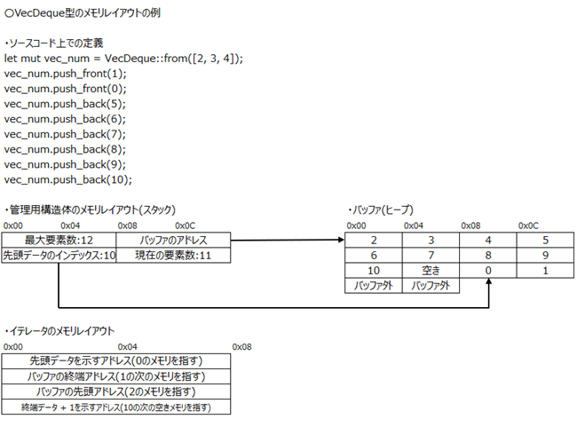

### HashMap型のメモリレイアウト

HashMap型のメモリレイアウトを以下に記載する。

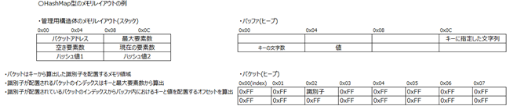

### 管理構造体

型は以下の構造体で管理されている。
デバッグビルドの場合、`capacity()`や`len()`では、本構造体が参照される。

* Vec型

```c
stack {
    offset + 0x00: 最大要素数, 
    offset + 0x08: ヒープへのアドレス,
    offset + 0x10: 現在の要素数,
}
```

* VecDeque型

```c
stack {
    offset + 0x00: 最大要素数, 
    offset + 0x08: ヒープへのアドレス,
    offset + 0x10: 先頭データのインデックス,
    offset + 0x18: 現在の要素数,
}
```

* HashMap型

```c
stack {
    offset + 0x00: バケット（キーから生成されるハッシュ値が格納されているデータ構造）のアドレス, 
    offset + 0x08: 最大要素数,
    offset + 0x10: 空き要素数,
    offset + 0x18: 現在の要素数,
    offset + 0x20: 乱数,
}
```

## 詳細

調査に使用したサンプルプログラムは、[後半](#使用したサンプルプログラム)に記載している。

### Vec型

#### 型の生成

Vec型は以下のとおりヒープメモリに確保される。

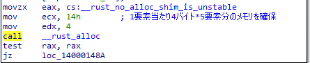

以下が、確保したヒープに対してデータを配置するコードである。
同時に管理構造体の初期化も行われる。

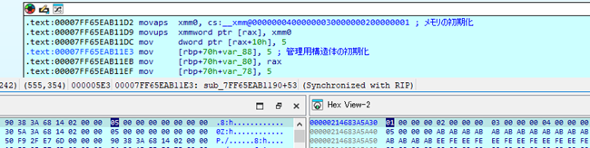

#### 要素の追加

以下は、`push()`とその前後の管理用構造体とバッファーを示している。
リリースビルドでは最適化により`push()`がインライン展開されており、関数呼び出しとしては確認できないが、データの追加や、Vecの管理用構造体の更新が行われている。

* push前の管理用構造体とバッファー

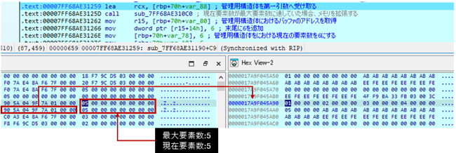

* push後の管理用構造体とバッファー

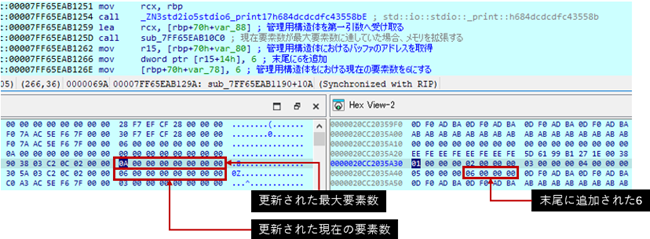

以下は、`insert()`およびその前後の管理用構造体とバッファーを示している。
同様に、リリースビルドでは最適化の影響で`insert()`もインライン展開されているが、挿入位置以降のデータを後方に移動し、新しいデータを挿入する処理が行われる。
しかし、最適化の影響で管理用構造体における現在の要素数が更新されていない。一方、デバッグビルドでは管理用構造体の更新も行われていた。

* insert前の管理用構造体とバッファー

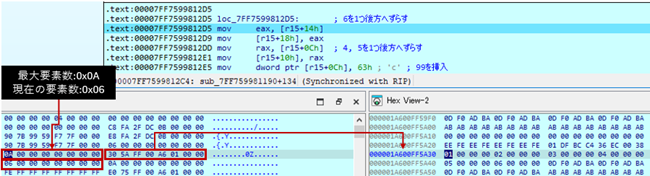

* insert後の管理用構造体とバッファー

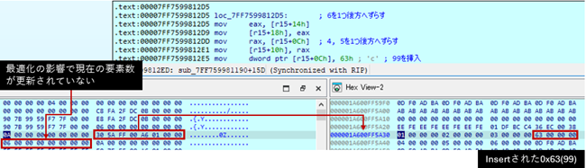

### VecDeque型

#### 型の生成

VecDeque型は以下のとおりバッファーの確保を行った後、そのメモリに対してデータを配置する。
最後に、スタックに管理用構造体を構築する。

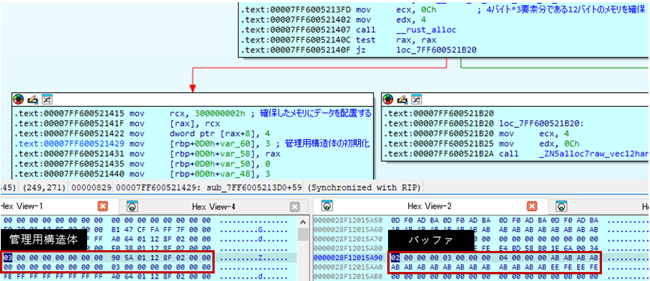

#### 要素の追加

VecDeque型は循環バッファーとして設計されている。
以下は、`push_front()`を用いたデータ挿入時のメモリ上の配置の例である（サンプルプログラム参照）。
リリースビルドでは最適化の影響で`push_front()`がインライン展開されており、関数呼び出しを確認できなかったが、データの追加やVecDequeの管理用構造体の更新が行われる。

* push_front前の管理用構造体とバッファー

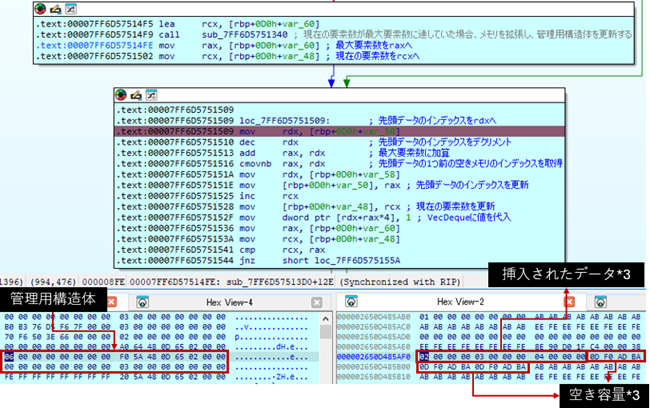

* push_front後の管理用構造体とバッファー

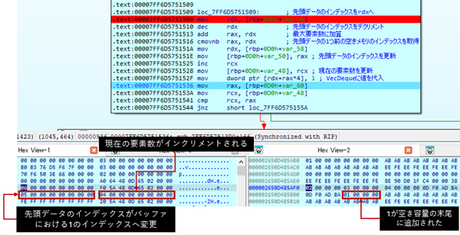

`push_front()`の実行によりバッファーには、既存データの末尾にデータが追加される。
この挙動はVecDequeの循環バッファーの特性によるものと考えられ、管理用構造体は、データ挿入後、現在の要素数がインクリメントされる。
また、データ挿入前は先頭データが2であったため、管理用構造体における先頭データのインデックスは`0`である。
挿入後は`push_front()`によって2の前方に1が追加されるため先頭データは1となり、管理用構造体における先頭データのインデックスは、データが最後尾に追加されることで`5`となる。

### HashMap型

#### 型の生成

以下は、`HashMap::new()`によるHashMapの作成処理を示すアセンブリである。
最適化の影響で`HashMap::new()`の呼び出しは確認できないが、HashMapの管理用構造体を作成する処理が確認できる。
Windows APIの`ProcessPrng()`を用いて16バイトの乱数を取得する。
この乱数は8バイトずつ扱われ、HashMapは入力されたキーからハッシュ値を生成し、キーおよび値と紐づけて管理している。
この乱数は、キーからハッシュ値を生成する際に使用される。その後、スタックにHashMapの管理用構造体が構築される。
Rustでは、`v1.35`以降のバージョンで、HashMapのアルゴリズムとして`SwissTable`が使用されており、またHash関数として`SipHash`が使用されている。

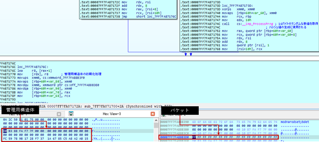

#### 要素の追加

HashMap型の要素追加である`insert()`は、アセンブリ内では第一引数に管理用構造体、第二引数にキー、第三引数に値を受け取る。
その後、以下の流れで、値の追加を行う。

* 1. ハッシュ値の生成

標準ライブラリ関数`core::hash::BuildHasher::hash_one()`でキーと管理用構造体の乱数をもとにハッシュ値を生成。
このハッシュ値はキーおよび値と紐づく識別子の生成やバケット内に識別子が配置されるインデックスの生成に使用される。

* 2. 識別子の生成と重複確認

ハッシュ値の生成後、次に識別子の生成および重複確認を行う。
生成したハッシュ値を右に`0x39`ビットシフトすることで、上位7ビットを抽出する。
この値は、キーと値に紐づく識別子としてバケットに配置される。
識別子の特徴として、上位7ビットを抜き出し、その値を1バイトの数値として扱うため、識別子の上位1ビットは必ず0になる。
この特性は、バケット内にすでに識別子が存在するかどうかを判別する際に利用される。

その後、識別子の重複確認を行う。
ハッシュ値と最大要素数の論理積を計算し、その結果をオフセットとし、バケットから16バイト分の値を取得する。
`pcmpeqb`命令を用いて、バケットから取得した16バイトの値の中に識別子がすでに存在しているかどうかをチェックする。
`pcmpeqb`命令は16バイトを1バイトずつ比較し、一致したバイト列があれば第一オペランドの同じ位置に`0xFF`を配置する。
一致しない箇所は`0x00`が配置される。
命令実行後の第一オペランドが`0x00`で埋まっていれば、識別子は重複していないといえる。

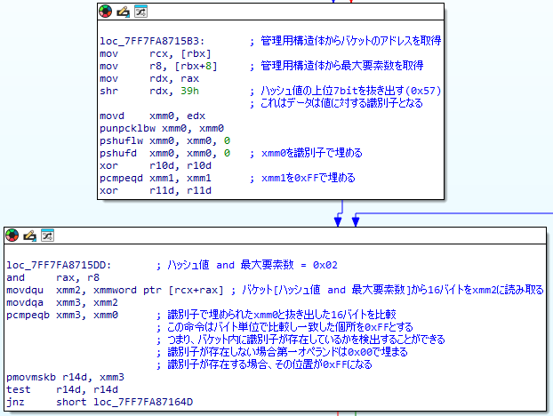

* 3. インデックスの生成

識別子の生成後、識別子がバケット内のどこに配置されるかを示すインデックスを生成する。
`pmovmskb`命令を使用して、「2. 識別子の生成と重複確認」でバケットから取得した16バイトのデータをもとにマスクを生成する。
`pmovmskb`命令は、第二オペランドに指定した16バイトのレジスタ内の各バイトの最上位ビットを抽出し、ビット列として第一オペランドに集約する。
バケット内の未使用領域は`0xFF`で埋められており、最上位ビットは1になる。
前項で説明したとおり、識別子の最上位ビットは必ず0となるため、`pmovmskb`命令で集約されたビット列では、識別子が配置されている部分のビットは0になり、未配置の部分のビットは1となる。
続いて、このマスクに対して`tzcnt`命令を実行する。
`tzcnt`命令は、第二オペランドに指定した値の下位ビットから最初に1が現れるまでの連続する0の数をカウントし、その結果を第一オペランドに格納する。
この処理により、バケット内の下位からいくつの領域がすでに埋まっているかを算出できる。
さらに、`tzcnt命令`で算出したカウントに、前項でも使用したハッシュ値と最大要素数の論理積の結果を加算する。
この加算により、識別子が配置されるべきインデックスの候補が求められる。
最後に、この加算結果と最大要素数の論理積をとることで、インデックスが最大要素数内に収まるように調整する。
この最終的な値が識別子の配置先インデックスとして使用される。

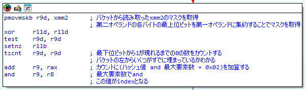

* 4. 管理用構造体、バケット、バッファーの更新

最後に、管理用構造体、バケット、およびバッファー（キーと値の格納場所）の更新を行う。
要素の追加の場合は、管理用構造体の要素数が増加、空き要素数の減少などが行われる。


## 使用したサンプルプログラム

* Vec型

```rust
fn main() {
    // 1. Vecの作成
    let mut vec_num = vec![1, 2, 3, 4, 5];
    
    // 2. Vecの長さと容量
    println!("vec_numの長さ: {}, 容量: {}", vec_num.len(), vec_num.capacity());

    // 3. 要素の追加
    vec_num.push(6);
    println!("vec_numの長さ: {}, 容量: {}", vec_num.len(), vec_num.capacity());

    vec_num.insert(3, 99);

    // 4. イテレーション
    // vec_numを奇数のみのVecにする
    let odd_numbers: Vec<i32> = vec_num.iter()
        .filter(|&num| num % 2 != 0)
        .cloned()
        .collect();
    
    println!("odd_numbersの要素:");
    for value in &odd_numbers {
        println!("{}", value);
    }
}
```

* VecDeque型

```rust
use std::collections::VecDeque;

fn main() {
    // 1. VecDequeの作成
    let mut vec_num = VecDeque::from([2, 3, 4]);
    let vec_iter_test = VecDeque::from([0, 1, 2]);

    let it = vec_num.iter();

    // 2. VecDequeの長さと容量
    println!("vec_numの長さ: {}, 容量: {}", vec_num.len(), vec_num.capacity());

    // 3. 要素の追加
    vec_num.push_front(1);
    vec_num.push_front(0);
    vec_num.push_back(5);
    vec_num.push_back(6);
    vec_num.push_back(7);
    vec_num.push_back(8);
    vec_num.push_back(9);
    vec_num.push_back(10);

    let it2 = vec_num.iter();

    let num = vec_num[3];
    println!("{}", num);

    // 4. 要素の削除
    vec_num.pop_front();
    // vec_num.pop_back();

    // 5. イテレータトレイト
    let numbers: VecDeque<i32> = vec_num.iter()
        .filter(|&&num| num % 2 != 0)
        .map(|&num| num * 2)
        .collect();
    
    println!("numbersの要素:");
    for value in &numbers {
        println!("{}", value);
    }
    
    let numbers: VecDeque<i32> = vec_iter_test.iter()
        .filter(|&&num| num % 2 != 0)
        .map(|&num| num * 2)
        .collect();

    println!("numbersの要素:");
    for value in &numbers {
        println!("{}", value);
    }
}
```

* HashMap型

```rust
use std::collections::HashMap;

fn main() {
    // HashMapの作成
    let mut processes = HashMap::new();

    // 要素の追加
    processes.insert("ProcessA", 1001);
    processes.insert("ProcessB", 1002);
    processes.insert("ProcessC", 1003);

    // 容量と要素数の取得
    println!("processesの長さ: {}, 容量: {}", processes.len(), processes.capacity());

    // 容量を超えるデータの追加
    processes.insert("ProcessD", 1004);

    println!("processesの長さ: {}, 容量: {}", processes.len(), processes.capacity());

    // 存在する要素の取得
    let pid = processes.get("ProcessB");
    match pid {
        Some(&id) => println!("PID of ProcessA.exe: {}", id),
        None => println!("ProcessA.exe not found"),
    }

    // 存在しない要素の取得
    let pid = processes.get("ProcessE");
    match pid {
        Some(&id) => println!("PID of ProcessD.exe: {}", id),
        None => println!("ProcessD.exe not found"),
    }

    // 存在するデータの削除
    processes.remove("ProcessA");
    
    // 存在しないデータの削除
    processes.remove("ProcessE");
}
```