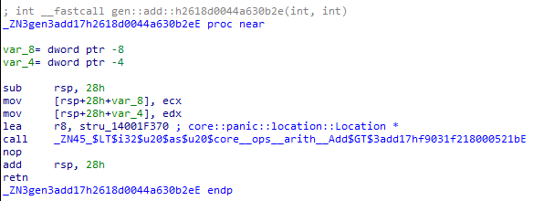
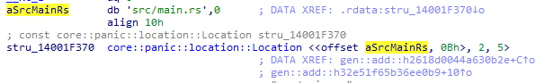

# 同一ジェネリクスから生成された関数の識別

同一ジェネリック関数から生成した関数が、生成元となった関数を特定する方法があるかを調査した。

## 調査結果

* `core::panic::Location`構造体を利用してパニックを発生させる処理が関数内にある場合、同一のジェネリック関数で生成された関数の特定が可能である。
  - `core::panic::Location`構造体はパニックが発生するソースコードのパス、行番号、列番号を含む構造体である。
  - 異なる関数の場合、行番号や列番号が一致しないが、同一のジェネリック関数から生成された関数の間ではソースコードのパス、行番号、列番号がすべて一致する。

なお、ジェネリック関数がインライン展開されている場合（リリースビルドおよび最小化バイナリ）や、`core::panic::Location`構造体の情報を削除するビルドオプションが使用されている場合、この方法で特定することはできない。

## 詳細

最適化の影響を受けないデバッグビルドの場合、以下のように関数実行時の第三引数にて`core::panic::Location`構造体を受け取る。
バイナリ内の`core::panic::Location`構造体を探索し、各構造体が、2つ以上の参照場所がある場合、参照元の関数は同じジェネリック関数から生成された関数である。

`core::panic::Location`構造体の中身を以下に示す。
この例では、パスが「src/main.rs」、行番号が2、列番号が5であることを示している。

同じジェネリック関数から生成された関数であるならば、内部処理の類似性は高いと考えられるため、生成元が同じ関数の解析を省く、差異のみを解析するなどで解析時間の短縮につながる。

32ビットバイナリにおいても、`core::panic::Location`構造体のサイズは異なるが、同じような特徴がみられた。
