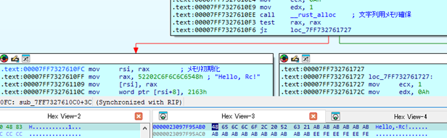

# スマートポインター

RustのスマートポインターであるBox型、Rc型、Cell型、RefCell型、それぞれのアセンブリ上の特徴およびメモリレイアウトを調査した。

## 調査結果

各型の構造体と仕様について以降で説明する。

## 詳細

### Box<T>

#### 1. Box<T>の生成

`__rust_alloc()`でヒープメモリを確保する。(最終的にはWindows APIの`HeapAlloc()`でメモリを確保する。)

#### 2. メモリの初期化

`Box<T>`を連鎖構造で定義した場合、以下のようにヒープが初期化される。
Rustではデフォルトでサイズが大きい順にメモリに配置される。

```c
変数firstのヒープメモリ {
    Offset+0x00: next: second address
    Offset+0x08: value: 0x00000001
}
変数second のヒープメモリ {
    Offset+0x00: next: third address
    Offset+0x08: value: 0x00000002
}
変数thirdのヒープメモリ{
    Offset+0x00: next: 0x00000000
    Offset+0x08: value: 0x00000003
}
```

#### 3. 自動解放

`Box<T>`は自動解放を実装している。
以下は、自動解放処理の内部処理である。
`sub_7FF7AFC41030()`は再帰関数となっている。
これにより、連鎖構造になっているメモリでも解放することができる。


### Rc<T>

#### 1. メモリの初期化 Rc::new()

`Rc<T>`のメモリ初期化はインライン展開される。
ヒープにメモリを確保し、さらにRc`<T>`管理用構造体をヒープに確保する。



`Rc<T>`管理用構造体は、以下のとおりである。
最小化バイナリにおいても同様の管理用構造体が作成される。
32ビットバイナリでもアドレスを4バイトで扱う点を除けば同様である。

```c
Rc<T> 管理用構造体 {
    0x00: 強参照カウント
    0x08: 弱参照カウント
    0x10: 型パラメーターに指定された具象型
}
```

### Cell<T>

リリースビルドおよび最小化バイナリでは、最適化によって当該の処理が削除される。
また、デバッグビルドのバイナリでも特徴的な処理はないため、Cell型が使用されているか識別することは出来ない。

### RefCell<T>

#### 1. メモリの初期化 RefCell<T>

RefCellの管理用構造体は以下のとおりである。

```c
RefCell<T> 管理用構造体 {
    0x00: Ref Counter
    0x08: 型パラメーターに指定された具象型
}
```

RefCellは借用と可変借用という概念があり、借用は複数の変数から可能だが、可変借用できるのは一つの変数のみという制約がある。
借用を実行する関数である`borrow()`を呼び出すと`Ref Counter`がインクリメントされる。
また、可変借用を行う`borrow_mut()`を呼び出すと`Ref Counter`が`-1`となる。
そのため、`Ref Counter`が0未満という状況は可変借用中であることを示しており、この時に借用・可変借用を行うと実行時エラーが発生する。


## 使用したサンプルプログラム

* Box型のサンプルプログラム

```rust
struct Node {
    value: i32,
    next: Option<Box<Node>>,
}

impl Node {
    fn new(value: i32) -> Self {
        Node { value, next: None }
    }
}

fn main() {
    let mut first = Box::new(Node::new(1));
    first.next = Some(Box::new(Node::new(2)));

    if let Some(ref mut next_node) = first.next {
        next_node.next = Some(Box::new(Node::new(3)));
    }
    
    println!("First value: {}", first.value);
    if let Some(ref next_node) = first.next {
        println!("Next value: {}", next_node.value);
        if let Some(ref next_next_node) = next_node.next {
            println!("Next next value: {}", next_next_node.value);
        }
    }
}
```

* Rc型のサンプルプログラム

```rust
use std::rc::{Rc, Weak};

fn main() {
    // Rcを使って、共有するデータを作成
    let data = Rc::new("Hello, Rc!".to_string());

    // Rcの参照カウントを確認
    println!("Initial reference strong count: {}", Rc::strong_count(&data));
    println!("Initial reference weak count: {}", Rc::weak_count(&data));

    {
        // 弱参照が増加
        let weak_ref: Weak<String> = Rc::downgrade(&data);
        println!("Reference strong count after downgrade: {}", Rc::strong_count(&data));
        println!("Reference weak count after downgrade: {}", Rc::weak_count(&data));
    }

    // dataをcloneして新しいRcを作成（強参照カウントが増加）
    let data_clone1 = Rc::clone(&data);
    println!("Reference strong count after clone1: {}", Rc::strong_count(&data));
    println!("Reference weak count after clone1: {}", Rc::weak_count(&data));

    // もう一つclone（強参照カウントが増加）
    let data_clone2 = Rc::clone(&data);
    println!("Reference strong count after clone2: {}", Rc::strong_count(&data));
    println!("Reference weak count after clone2: {}", Rc::weak_count(&data));

    // 各変数がデータを参照
    println!("Original data: {}", data);
    println!("Clone 1 data: {}", data_clone1);
    println!("Clone 2 data: {}", data_clone2);

    // data_clone1とdata_clone2がスコープを抜けると参照カウントが減少
    drop(data_clone1);
    println!("Reference strong count after dropping clone1: {}", Rc::strong_count(&data));
    println!("Reference weak count after dropping clone1: {}", Rc::weak_count(&data));

    drop(data_clone2);
    println!("Reference strong count after dropping clone2: {}", Rc::strong_count(&data));
    println!("Reference weak count after dropping clone2: {}", Rc::weak_count(&data));

    // 最後にdataがスコープを抜けるとメモリが解放される
    drop(data);
    println!("Dropped the original data.");
}
```

* Cell型のサンプルプログラム

```rust
use std::cell::Cell;

pub struct Immutable {
    a: i32,
    b: Cell<i32>,
}

fn main() {
    let x = Immutable { a: 10, b: Cell::new(5) };
    x.b.set(x.b.get() + 10);

    println!("Immutable.a = {}", x.a);
    println!("Immutable.b = {}", x.b.get());
}
```

* RefCell型のサンプルプログラム

```rust
use std::cell::RefCell;

struct MyStruct {
    value: i32,
    name: String,
    description: String,
}

impl MyStruct {
    fn new(value: i32, name: &str, description: &str) -> Self {
        MyStruct {
            value,
            name: name.to_string(),
            description: description.to_string(),
        }
    }
}

fn main() {
    let my_struct = RefCell::new(MyStruct::new(5, "Example", "This is a sample struct."));

    // 値を借用して読み取る
    {
        let borrowed_struct = my_struct.borrow();
        println!("Borrowed value: {}", borrowed_struct.value); // 5と表示される
        println!("Name: {}", borrowed_struct.name); // "Example"と表示される
        println!("Description: {}", borrowed_struct.description); // "This is a sample struct."と表示される
    } // borrowed_structのスコープが終了し、借用が解放される

    // 値を変更するために可変借用を行う
    {
        let mut borrowed_mut_struct = my_struct.borrow_mut();
        borrowed_mut_struct.value += 10; // 5に10を加算
        borrowed_mut_struct.name = "Updated Example".to_string(); // 名前を更新
        borrowed_mut_struct.description = "This struct has been updated.".to_string(); // 説明を更新
    } // mutable borrowがここで終了する

    // 再度値を借用して読み取る
    {
        let updated_borrowed_struct = my_struct.borrow();
        println!("Updated value: {}", updated_borrowed_struct.value); // 15と表示される
        println!("Updated Name: {}", updated_borrowed_struct.name); // "Updated Example"と表示される
        println!("Updated Description: {}", updated_borrowed_struct.description); // "This struct has been updated."と表示される
    }
}
```