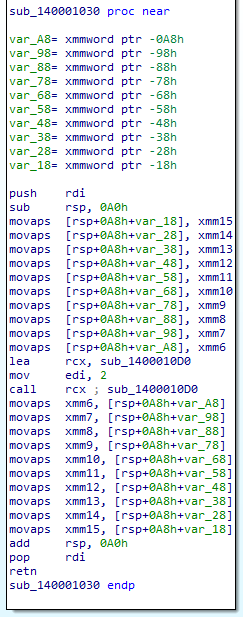

# インラインアセンブリ

インラインアセンブリで使用される各キーワード（in、out、inout、lateout、inlateout、options、clobber）のアセンブリ上の特徴を調査した。

## 調査結果

一部特徴的なアセンブリが確認できるものの、ほとんどのキーワードでアセンブリ上の特徴は確認できない。

## 詳細

`clobber_abi`(ABIで保存されないレジスタを保存する)を使用したバイナリをリリースビルドにした場合、関数プロローグにてxmm6～15レジスタがスタックへ保存され、関数エピローグにて復元される処理が追加されるが、それ以外の特徴はない。



## 使用したサンプルプログラム

```rust
#![allow(unused)]
fn main() {
    #[cfg(target_arch = "x86_64")] { //32bitバイナリを作成する際はx86へ変更
        use std::arch::asm;

        extern "C" fn foo(arg: i32) -> i32 {
            println!("arg = {}", arg);
            arg * 2
        }

        fn call_foo(arg: i32) -> i32 {
            unsafe {
                let result;
                asm!(
                    "call {}",
                    // Function pointer to call
                    // 呼び出す関数ポインター
                    in(reg) foo,
                    // 1st argument in rdi
                    // 最初の引数はrdiにある
                    in("rdi") arg,
                    // Return value in rax
                    // 戻り値はraxにある
                    out("rax") result,
                    // Mark all registers which are not preserved by the "C" calling
                    // convention as clobbered.
                    // "C"の呼び出し規約で保存されていないすべてのレジスタをクロバーに指定
                    clobber_abi("C"),
                );
                result
            }
        }
        call_foo(2);
    }
}
```