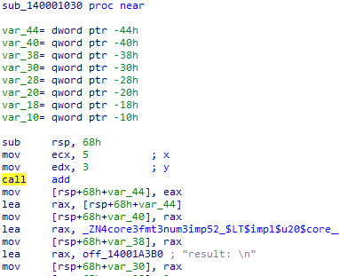
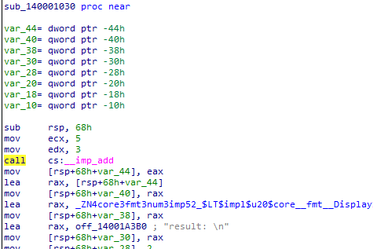

# link属性

Rust の `link` 属性を用いることで、ライブラリのリンク方法を指定できる。本調査では、`dylib`、`static`、`raw-dylib` の各設定値を指定した場合に、アセンブリ上でどのような差異が生じるかを調査した。

## 調査結果

呼び出し方や実装について通常関数との差異は確認できない。

## 詳細

### static

staticでリンクしたバイナリのadd()呼び出したものが以下である。
ライブラリの関数が実行ファイルに埋め込まれており、呼び出し方や実装について通常関数との差異はない。

### dylib

Windowsでは動的リンクは`raw-dylib`のみ対応しているため、調査未実施。

### raw-dylib

raw-dylibでリンクしたバイナリの`add()`呼び出したものが以下である。
Windows APIの呼び出しと同じように、IATを用いた関数呼び出しになっている。

