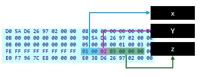

# repr属性

`repr` 属性は、構造体などのメモリレイアウトを制御するために使用できる。本調査では、指定可能な各オプションがメモリレイアウトにどのような影響を与えるかを調査した。

## 調査結果

構造体のメモリレイアウトは以下のとおりである。

* **`#[repr(Rust)]`**
  - ソースコード上の定義順に関係なく、サイズが大きいフィールドから順にメモリへ配置される（アラインメントあり）。

* **`#[repr(C)]`**
  - C/C++ と互換性のあるメモリレイアウトとなり、ソースコードでの定義順にメモリ上へ配置される（アラインメントあり）。

* **`#[repr(packed(1))]`**
  - メモリアラインメントを指定するオプションであり、ソースコードでの定義順にメモリへ配置される（アラインメントなし）。

## 詳細

### \#\[repr(Rust)\]

`#[repr(Rust)]`は明示的に属性を指定しなかった場合のデフォルトであるが、サンプルコードの場合、構造体のメモリレイアウトは以下のようになる。
アラインメントの影響でi8型である変数yにも2バイトのメモリが割り当てられており、合計が32バイトとなっている。
また、ソースコード上の定義順に関わらずサイズが大きい変数からメモリに配置される。
同じバイト数の変数はソースコード上の定義順にメモリに配置される。


### \#\[repr(C)\]

`#[repr(C)]`を指定した場合、C/C++言語と互換性のあるメモリレイアウトとなる。
サンプルコードの場合、構造体のメモリレイアウトは以下のとおりである。
ソースコードでの定義順と、メモリ上での配置が一致しており、また`#[repr(Rust)]`と同様、アラインメントの影響でi8型である変数yにも2バイトのメモリが割り当てられて、合計が32バイトとなる。
なお、空いているメモリは`0x00`で初期化されず、もともと配置されていたランダムなデータ(`0x72`)がそのまま残っている。
また、32ビットバイナリでは、nameの管理用構造体が4バイトで扱われるため、構造体のバイト数に差異が生じるが、メモリ配置に差異はない。
最小化バイナリにおいても構造体のバイト数およびメモリ配置に差異はない。


### \#\[repr(packed(1))\]

`#[repr(packed(1))]`はメモリのアラインメントを指定することができるオプションである。
サンプルコードの場合、構造体のメモリレイアウトは以下のとおりである。
RustやC言語とは異なり、i8型である変数yには1バイトのメモリが割り当てられており、合計サイズは7バイトとなった。
また、C言語と同様、ソースコードでの定義順とメモリ上での配置が一致している。
なお、32ビットバイナリおよび最小化バイナリにて差異はない。
 


## 使用したサンプルプログラム

```rust
use std::mem;

#[derive(Debug)]
#[repr(Rust)]
struct RustStruct {
    x: i16,
    y: i8,
    z: i32,
    name: String,
}

#[derive(Debug)]
#[repr(C)]
struct CStruct {
    x: i16,
    y: i8,
    z: i32,
    name: String,
}

#[derive(Debug)]
#[repr(packed(1))]
struct Packed1Struct {
    x: i16,
    y: i8,
    z: i32,
}

fn main() {
    let rust_struct = RustStruct {x:1, y:3, z:5, name: String::from("Rust Struct")};
    let c_struct = CStruct {x:2, y:4, z:6, name: String::from("C Struct")};
    let packed_1_struct = Packed1Struct {x:1, y:2, z:3};

    println!("{:?}", rust_struct);
    println!("size: {}", mem::size_of::<RustStruct>());
    println!("{:?}", c_struct);
    println!("size: {}", mem::size_of::<CStruct>());
    println!("{:?}", packed_1_struct);
    println!("size: {}", mem::size_of::<Packed1Struct>());
}
```