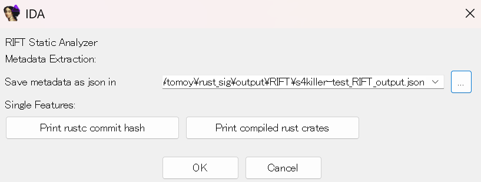

# 標準・サードパーティライブラリの判別方法

マルウェアを分析する際には、標準ライブラリまたはサードパーティライブラリのコードを識別し、攻撃者が作成したコードを重点的に分析することが望ましい。本調査では、IDA Proの FLIRT を用いた標準ライブラリおよびサードパーティライブラリの関数識別方法について検証を行った。

## 調査結果

* [rustbinsign](https://github.com/N0fix/rustbinsign) と [RIFT](https://github.com/microsoft/RIFT) を利用して、標準ライブラリおよびサードパーティライブラリ向けのシグネチャを作成可能。

* 分析対象マルウェアと同一のコンパイルオプションを使用して生成したシグネチャファイルが、関数識別数と識別精度の両面で最も優れていることが検証により判明した。

## 詳細

### FLIRTシグネチャ作成と適用

#### 使用されているライブラリやバージョンの特定

シグネチャの作成に前準備として、解析対象となる実行ファイルがどのクレートを使用しているのか、またRustバージョンを使用しているのかを識別する必要がある。
そのために、rustbinsignでは`info`コマンドを使用することができる。
本コマンドを使用することで、rustコンパイラのバージョンや使用しているクレートの特定が可能である。
rustコンパイラや使用しているクレート名とそのバージョンは、`Location`構造体の`file`フィールドから抽出しているため、
`location-detail=none`オプションが使用されていると使用しているクレートが取得できなくなる。
```
> rustbinsign info s4killer.exe
TargetRustInfo(
    rustc_version='1.87.0',
    rustc_commit_hash='4d30011f6c616be074ba655a75e5d55441232bbb',
    dependencies=[
        Crate(name='crossbeam-deque', version='0.8.5', features=[], repository=None),
        Crate(name='crossbeam-epoch', version='0.9.18', features=[], repository=None),
        Crate(name='crossbeam-utils', version='0.8.19', features=[], repository=None),
        Crate(name='hashbrown', version='0.15.2', features=[], repository=None),
        Crate(name='once_cell', version='1.19.0', features=[], repository=None),
        Crate(name='rayon', version='1.8.1', features=[], repository=None),
        Crate(name='rayon-core', version='1.12.1', features=[], repository=None),
        Crate(name='sysinfo', version='0.30.5', features=[], repository=None),
        Crate(name='windows', version='0.52.0', features=[], repository=None),
        Crate(name='windows-core', version='0.52.0', features=[], repository=None)
    ],
    rust_dependencies_imphash='d9effc64c9481f9d445d7d35ba5db4b9',
    guessed_toolchain='windows-msvc'
)
```
また、`RIFT`をIDA Pluginとして適用することで、`json`ファイルとして出力することが可能である。
```
{
    "commithash": "05f9846f893b09a1be1fc8560e33fc3c815cfecb",
    "target_triple": "pc-windows-msvc",
    "arch": "x86_64",
    "crates": [
        "crossbeam-epoch-0.9.18",
        "once_cell-1.19.0",
        "rayon-1.8.1",
        "windows-0.52.0",
        "windows-core-0.52.0",
        "crossbeam-deque-0.8.5",
        "rustc-demangle-0.1.24",
        "sysinfo-0.30.5",
        "hashbrown-0.15.2",
        "crossbeam-utils-0.8.19",
        "rayon-core-1.12.1"
    ]
}
```


#### 標準ライブラリ

標準ライブラリのシグネチャの作成は、`sign_stdlib`コマンドで作成することができる。
`rustbinsign`は、`C:\Users\<User名>\.rustup\toolchains`に保存されている標準ライブラリのDLLに対して、`idat`と`idb2pat.py`そして`sigmake`を用いて
シグネチャファイルを作成している。
```
> rustbinsign sign_stdlib -t 1.84.0-x86_64-pc-windows-msvc
```
[No.2 バイナリサイズ削減](gitlab.jpcert.or.jp/irt/rust-binary-analysis-research/-/blob/main/Public/Japanese/2_minimize_binary.md)に記載している`build-std`等のオプションを付けない限り、コンパイル済みの標準ライブラリがそのまま静的リンクされる。
また、`rustbinsign`でもコンパイル済みの標準ライブラリを用いてシグネチャが作成されるため、本コマンドに最適化オプション等を変更してシグネチャを作成するオプションは存在しない。

#### サードパーティライブラリ

サードパーティライブラリのシグネチャの作成は、`download_sign`または`sign_target`コマンドで作成することができる。
`download_sign`コマンドでは対象となるクレートを指定し対象のクレートのシグネチャを作成するのに対して、`sign_stdlib`コマンドでは実行ファイルから外部ライブラリの依存関係を抽出してシグネチャの作成を行う。
シグネチャの作成は、クレートをダウンロードし、`crate-type=dylib`オプションを指定することでDLLを作成し、その後標準ライブラリと同様に
`idat`と`idb2pat.py`と`sigmake`を用いてシグネチャファイルを作成している。
```
> rustbinsign download_sign --full-compilation windows-core-0.52.0 1.84.0-x86_64-pc-windows-msvc
```
加えて、`sign_target`コマンドでは、cargoのコンパイルオプションを`--template`オプションにて指定することが可能である。

また、`RIFT`のコンフィグファイルを設定し、Pythonスクリプトで`--flirt`オプションを付け実行することで`release`プロフィールを適用したサードパーティライブラリのシグネチャの作成が可能である。
```
[Default]
PcfPath = <IDAに含まれるFLAIRのpcf.exeのパス>
SigmakePath = <IDAに含まれるFLAIRのsigmake.exeのパス>
DiaphoraPath = <Diaphoraに含まれるdiaphora.pyのパス>
IdatPath = <IDATのパス>
WorkFolder = <シグネチャ等の出力先となるパス>
CargoProjFolder = <シグネチャ生成のために作成されるCargoプロジェクトの出力先となるパス>
```
```
> py rift.py --cfg rift_config.cfg --input <IDA Pluginで出力したJSONファイル> --flirt --output <出力先>
```
`RIFT`はこれ以外にも、`--binary-diff`オプションを付け実行し、実行結果をIDA GUI上から指定することで、FLIRTシグネチャではなく、バイナリ差分からサードパーティライブラリの関数を識別することが
可能である。

### 検証

シグネチャの識別率を高める方法について検証を行った。

#### 検証方法

[s4killer](https://github.com/gavz/s4killer)を以下のCargoコンパイルオプションと[No.2 バイナリサイズ削減](gitlab.jpcert.or.jp/irt/rust-binary-analysis-research/-/blob/main/Public/Japanese/2_minimize_binary.md)に記載したrustcオプションを用いてコンパイルし、関数の識別率と識別精度を測定した。
```
[profile.dev]
strip = false
debug = true

[profile.release]
opt-level = "s"
debug-assertions = false
overflow-checks = false
lto = "fat"
panic = "abort"
codegen-unit = 1
strip = false
debug = true
```

#### 検証結果

以下の表のとおり、コンパイルオプションが一致した時、最も関数の識別数と識別精度が高くなる傾向にあることが判明した。

| Target / Signature | dev          | release      | minsize      |
| ------------------ | ------------ | ------------ | ------------ |
| s4killer(dev)      | 2376 / 72.2% | 352 / 82.6%  | 365 / 79.3%  |
| s4killer(release)  |   97 / 57.6% | 148 / 59.1%  | 151 / 57.8%  |
| s4killer(minsize)  |    2 / 50.0% |  64 / 71.5%  | 274 / 59.5%  |
