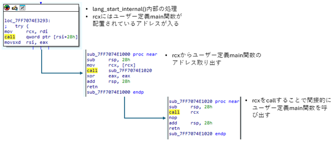
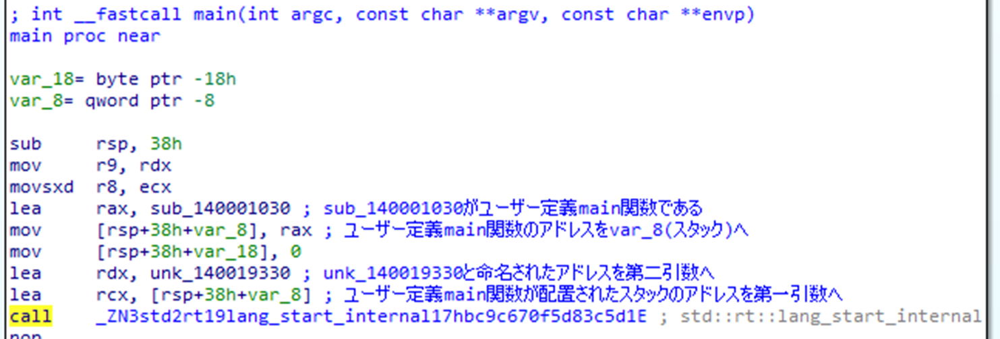
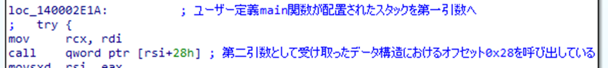
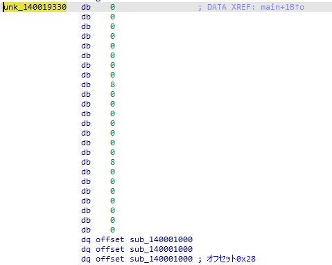
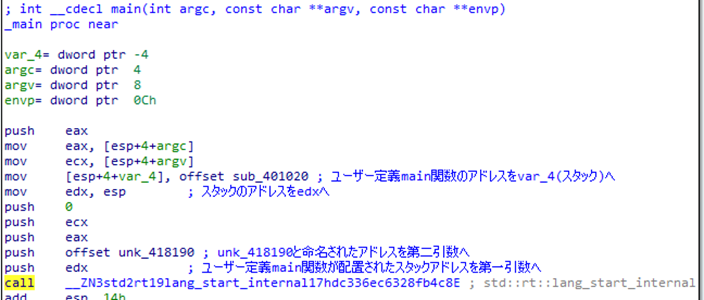
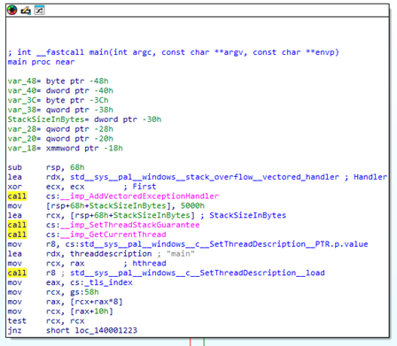
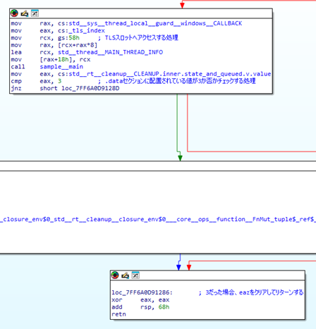
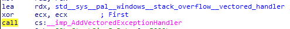
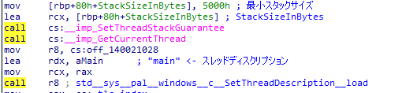
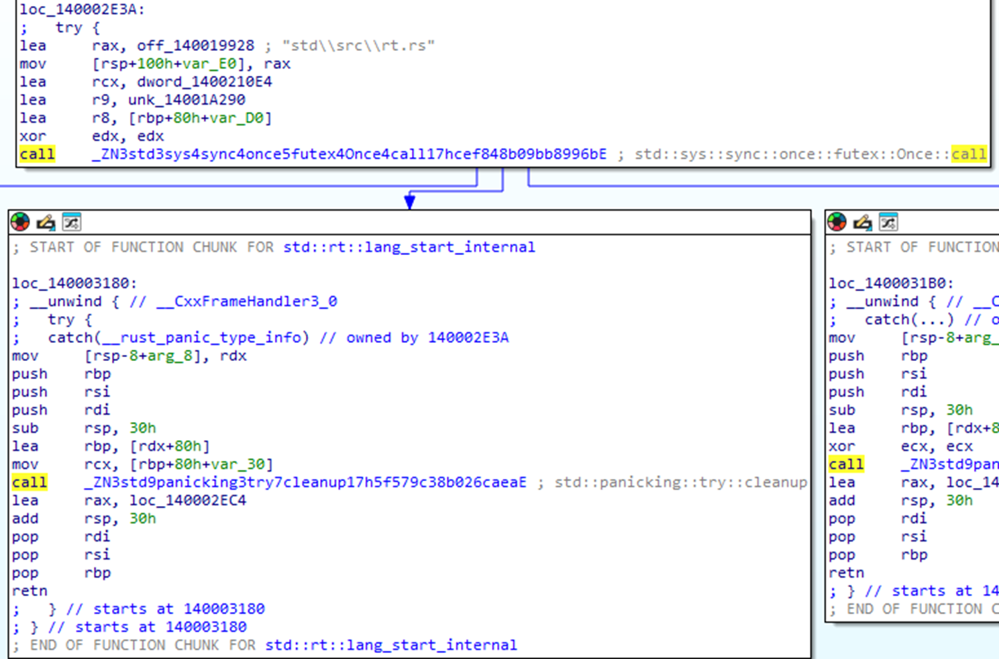

# main関数の特定と初期化処理

本調査では、Rustにおいてユーザーが定義したmain関数を特定する方法、その呼び出しまでの処理フロー、またmain関数が呼ばれる前に実施される初期化処理について調査した。

## 調査結果

ユーザー定義main関数の呼び出し過程の概要を以下の図に示す。
`lang_start_internal`関数の呼び出し時にユーザー定義main関数は第一引数に指定される。
そのため、`lang_start_internal`関数の呼び出しを確認することでユーザー定義main関数を特定することができる。
32ビットバイナリであっても処理の流れに相違がないことを確認した。

なお、最小化バイナリでは`lang_start_internal`関数はインライン化されており、直接ユーザー定義main関数が呼び出されることを確認した。

## 詳細

### main関数の特定

#### 64ビットバイナリの場合

リリースビルドのバイナリにおける`lang_start_internal`関数の呼び出し箇所を以下に示す。
ユーザー定義main関数をスタックへ配置し、そのアドレスを`lang_start_internal`関数の第一引数に指定する。
また、`lang_start_internal`関数の第二引数にunk_140019330と命名されたアドレスを受け取るが、これは動的ディスパッチ参照による仮想テーブルである。

さらに、`lang_start_internal`関数の内部処理の一部を以下に示す。

第二引数として受け取った仮想テーブルのオフセット0x28を呼び出す。
また、ユーザー定義main関数を配置したアドレスを第一引数として渡す。
第二引数として受け取った仮想テーブルのオフセット0x28を以下に示す。

オフセット0x28にはsub_140001000()のアドレスが配置されている。
この関数が内部でユーザー定義main関数を呼び出す。

#### 32ビットバイナリの場合

32ビットバイナリの場合も、引数の受け渡し方法などに差異はあるが、ユーザー定義main関数が呼び出される流れは64ビットバイナリとの間に差異はない。

#### 最小化バイナリの場合

最小化バイナリにおいては、`lang_start_internal`関数はインライン化されており、`lang_start_internal`関数が直接呼び出されている箇所はない。
mainと命名された関数の内部で`lang_start_internal`関数の内部処理と同様の処理を確認できる。

以下はユーザー定義main関数の呼び出し箇所である。
リリースビルドのバイナリとは異なり、ユーザー定義main関数が直接呼び出されている。
また、前後の処理の特徴として、TLSスロットへのアクセスや、.dataセクションに配置されている値のチェックなどがある。

### lang_start_internal関数の内部処理

#### 例外ハンドラーの設定

スタックオーバーフローが発生した際の例外ハンドラーの設定を行う。
Windows APIの`AddVectoredExceptionHandler()`にて、`std__sys__pal__windows__stack_overflow__vectored_handler()`が例外ハンドラーとして登録される。

#### 最小スタックサイズなどの設定

カレントスレッドの最小スタックサイズやスレッドディスクリプションの設定を行う。
Windows APIの`SetThreadStackGuarantee()`や`SetThreadDescription()`などを利用し設定する。

#### クリーンアップ処理

ユーザー定義main関数の呼び出し後のクリーンアップ処理を行う。

