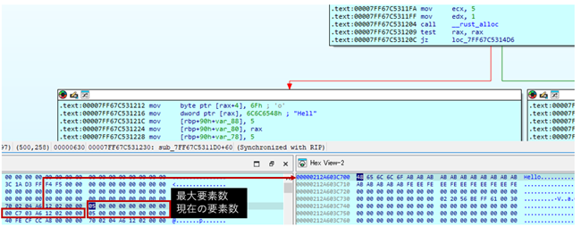
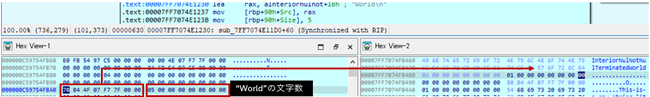
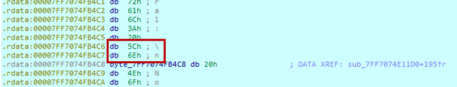

# 文字列

RustのString型および&str型がアセンブリレベルでどのように扱われるのかを明らかにするために調査した。

## 調査結果

* String型
  - 文字列本体はヒープに配置される。スタック上には、ヒープに配置可能な最大文字数、文字列へのポインター、現在の文字数を保持する構造体が生成され、String型の文字列を管理している。

* &str型
  - 文字列本体は.rdataセクションに配置される。スタック上には、文字列へのポインターと文字列の長さを保持する構造体が生成され、&str型の文字列を管理している。

* Raw string literal、C string literal、binary string literal
  - バイナリ上において、通常の文字列との扱いに差異はない。

また、32ビットバイナリおよび最小化されたバイナリにおいても、アドレスのサイズ以外では、文字列を管理するための構造体や扱い方に差異は見られなかった。

## 詳細

### 文字列のレイアウト

* String型

Rustの公式サイトによるとString型はVec<u8>であると記載されている。
[コレクション](17_collection.md)においても記述しているが、Vec型は最大要素数、バッファーへのアドレス、現在の要素数で構成される構造体により構成されている。

* &str型

スタックに文字列へのバッファーと文字数からなるデータ構造が構築されており、&str型は下記のようなデータ構造で管理される。

### 各種string literal

* Raw string literal

通常のプログラムでは`\n`が改行コードである0x0Aと変換されるはずであるが`r””`を使用した場合`\n`が`\`を示す0x5Cと`n`を示す0x6Eで表現されており、エスケープされていない状態でバイナリに埋め込まれる。
それ以外の通常の文字列と扱い方に差異がない。

* C string literal

通常の文字列と扱い方に差異がない。
`.text`セクションに埋め込まれる。

* binary string literal

通常の文字列と扱い方に差異がない。
`.rdata`セクションへ定義される。

