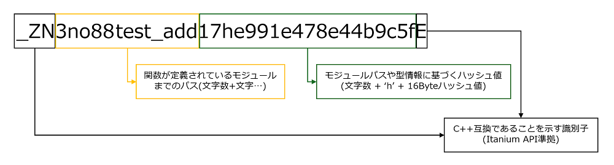
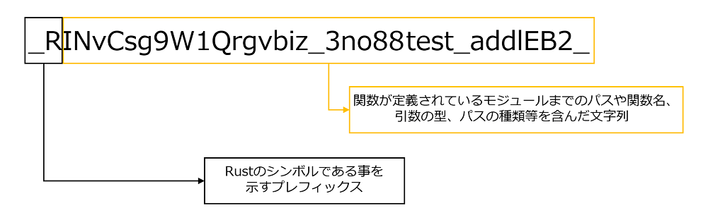

# 関数名のマングリング

マングリングされた関数名の構造およびデマングリング方法を明らかにすることを目的として調査した。

## 調査結果

Rustにおけるシンボルマングリングには、`legacy`と`v0`の2つのバージョンが存在する。現在のデフォルトは`legacy`であり、このバージョンではマングリングされたシンボル名に、その関数が定義されたモジュールパスや型情報に基づくハッシュ値が含まれる。

また、Rustのデマングリングツール[rustfilt](https://github.com/luser/rustfilt)を使用すると、`legacy`および`v0`の両バージョンのシンボルをデマングル可能である。

## 詳細

### マングリングのバージョン

Rustのシンボルマングリングには、`legacy`と`v0`バージョンの二つが存在しており、デフォルトは`legacy`バージョンである。
`v0`バージョンは、[RFC2603](https://rust-lang.github.io/rfcs/2603-rust-symbol-name-mangling-v0.html)で提案されており、`sysmbol-mangling-version`オプションで指定することができる。

### `legacy`バージョンでマングリングされたシンボルの構造

`legacy`バージョンで、マングリングされたシンボルの構造は以下のとおりである。



### `v0`バージョンでマングリングされたシンボルの構造

`v0`バージョンで、マングリングされたシンボルの構造は以下のとおりである。
`legacy`バージョンに対して、ジェネリックパラメーターの情報が失われていない点で異なる。
`v0`バージョンの詳細は、[v0 Symbol Format](https://doc.rust-lang.org/stable/rustc/symbol-mangling/v0.html)に記載されている。



### デマングリング方法

関数名のシンボルはマングリングされた状態で保持される。
下記は関数 `fn test_add<T>(a: T, b: T) -> T where T: std::ops::Add<Output = T>`が`i32`で単相化されたシンボルである。

```
[legacy]
_ZN3no88test_add17he991e478e44b9c5fE

[v0]
_RINvCsg9W1Qrgvbiz_3no88test_addlEB2_
```

上記のようにマングリングされたシンボルはバージョンにかかわらず、Rust Toolchainに含まれる`rustfilt`を用いることでデマングリングできる。
`rustfilt`を用いて上記の関数名をデマングリングした例を下記に示す。

```
PS> rustfilt '_ZN3no88test_add17he991e478e44b9c5fE'
no8::test_add

PS> rustfilt '_RINvCsg9W1Qrgvbiz_3no88test_addlEB2_'
no8::test_add::<i32>

```

### 32ビットおよび最小化バイナリにおける差異

32ビットバイナリであってもマングリングされたシンボルの構造は同様である。
しかし、同じ関数でも32ビットと64ビットの間でハッシュの部分に差異が発生した。
これは関数の型情報がハッシュ値の作成に関係しているからであると考えられる。
また、最小化バイナリではマングリングされたシンボルがpdbファイルに含まれない。