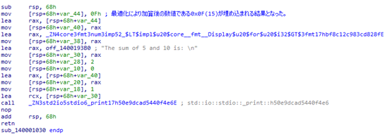
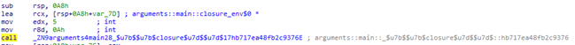
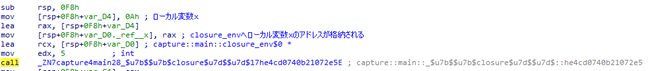
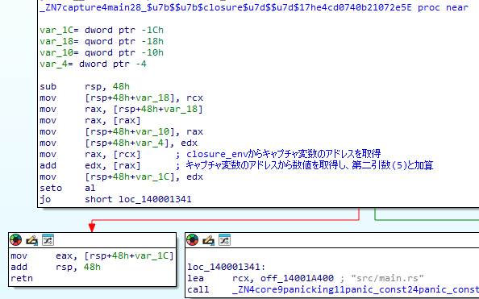
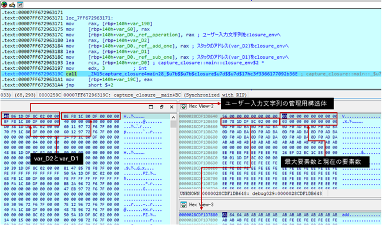
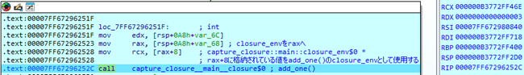

# クロージャ

クロージャの動作や使用されるメモリレイアウトを明らかにすることを目的として調査した。

## 調査結果

* クロージャは暗黙的に第一引数として、キャプチャする変数のアドレスを格納したスタック領域のアドレス（以降、`closure_env`と呼称する）を受け取る。変数をキャプチャしない場合でも、第一引数は`closure_env`となる。

* クロージャをキャプチャするクロージャでは、キャプチャ対象である子クロージャのアドレスは親の`closure_env`を経由せず、親クロージャの内部で直接参照される。

* ただし、子クロージャがキャプチャする変数は、親の`closure_env`内に子の`closure_env`が組み込まれる形で構造化される。

## 詳細

調査に使用したサンプルプログラムは、[後半](#使用したサンプルプログラム)に記載している。

### 基本的なクロージャ

サンプルプログラムをリリースビルドしたところ、以下の図のとおり最適化によって`sum()`の戻り値である15がバイナリに埋め込まれた。
このことから、単純なクロージャは最適化によって識別できない。



最適化を避けるためサンプルプログラムをデバッグビルドした結果(関数sum)が、以下の図である。
64ビットバイナリでは通常、第一引数はrcxレジスタ、第二引数はrdxレジスタ、第三引数はr8レジスタへ格納されるが、上記の関数の引数を確認すると明示的引数である5と10は第二引数と第三引数として渡されている。



第一引数を格納するrcxレジスタには、IDA Proによって`arguments::main::closure_env$0 *`と命名されたスタックのアドレスが格納されている。
クロージャの第一引数に渡されるスタックのアドレスにはクロージャがキャプチャした変数のアドレス`closure_env`が格納されるが、本サンプルプログラムでは変数をキャプチャしないクロージャであるため、クロージャの第一引数に渡されるアドレスは未使用となる。

### 変数をキャプチャするクロージャ

前項と同様にクロージャは最適化によって識別不可となるため、デバッグビルドにて調査した。
以下の図が、サンプルプログラムにおける、デバッグビルド時の`add_to_x()`の呼び出し箇所である。
ローカル変数xの値である`0x0A(10)`を`var_D4`へ格納している。
その後、`var_D4`のアドレスが`closure_env`を示す`var_D0`へ格納されている。
このように、クロージャの第一引数に渡されるスタックのアドレスにはクロージャがキャプチャした変数のアドレスが格納される。



クロージャの`_ZN7capture4main28_$u7b$$u7b$closure$u7d$$u7d$17he4cd0740b21072e5E()`の内部では、`closure_env`から取り出した値を明示的引数である5と加算しており、この処理は`add_to_x()`の処理と一致している。



### クロージャをキャプチャするクロージャ

前項と同様にクロージャは最適化によって識別不可となるため、デバッグビルドにて調査した。
以下は、サンプルプログラムにおける、デバッグビルド時の`double()`の呼び出し箇所である。
 


`_ZN15capture_closure4main28_$u7b$$u7b$closure$u7d$$u7d$17hc3f3366177092b36E()`が`double()`である。
`closure_env`には、ユーザー入力文字列、`add_one()`および`sub_one()`の`closure_env`が格納されている。
本サンプルプログラムでの`closure_env`の構造を以下に記載する。

```
closure_env {
   0x00: ユーザー入力文字列
   0x08: add_one()のclosure_env
   0x10: sub_one()のclosure_env
}
```

以下は、`add_one()`を呼び出すところであるが、第一引数に`closure_env + 0x08`を与えており、上記の構造体のアドレスを`closure_env`として使用していることがわかる。



### 32ビットおよび最小化バイナリにおける差異

32ビットバイナリにおいては、引数の受け渡し方法とアドレスのバイト数を除けば、すべてのサンプルにおいて同様である。
また、最小化バイナリにおいては、最適化の影響ですべてのサンプルにおいてクロージャはインライン展開され、単純な計算結果はバイナリに埋め込まれる。

## 使用したサンプルプログラム

* 基本的なクロージャ

```rust
fn main() {
    let sum = |a: i32, b: i32| -> i32 {
        a + b
    }

    println!("The sum of 5 and 10 is: {}", sum(5, 10));
}
```

* 変数をキャプチャするクロージャ

```rust
fn main() {
    let x = 10;

    let add_to_x = |y: i32| -> i32 {
        x + y
    };

    println!("The result of adding 5 to {} is: {}", x, add_to_x(5));
}
```

* クロージャをキャプチャするクロージャ

```rust
use std::env;

fn main() {
    let args: Vec<String> = env::args().collect();

    if args.len() != 2 {
        eprintln!("Usage: {} <add|sub>", args[0]);
        return;
    }

    let operation = &args[1];

    let add_one = |x: i32| x + 1;
    let sub_one = |x: i32| x - 1;

    let double = |y: i32| {
        match operation.as_str() {
            "add" => add_one(y) * 2,
            "sub" => sub_one(y) * 2,
            _ => {
                eprintln!("Invalid operation. Use 'add' or 'sub'.");
                std::process::exit(1);
            }
        }
    };

    let input_value = 3;

    println!("The result is: {}", double(input_value));
}
```
